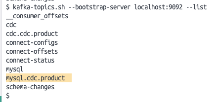
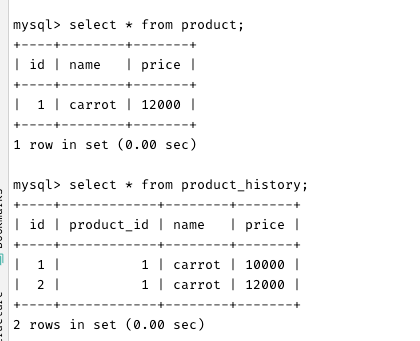

# 카프카 씽크, 소스 커넥터 활용

## 프로젝트 실행
### 1. debezium-connector-mysql 다운로드 ([링크](https://www.confluent.io/hub/debezium/debezium-connector-mysql))

### 2. mysql-connector-java 다운로드 ([링크](https://mvnrepository.com/artifact/mysql/mysql-connector-java/8.0.27))

### 3. confluentinc-kafka-connector-jbc 다운로드([링크](https://www.confluent.io/hub/confluentinc/kafka-connect-jdbc))

### 4. 2에서 다운로드 받은 jar 파일을 3에서 다운로드 받은 파일의 lib 폴더 하위로 이동

### 5. start.sh 파일 실행
```bash
sh start.sh
```

### 6. 카프카 커넥터 실행
#### 소스 커넥트
```bash
curl --location 'http://localhost:8083/connectors' \
--header 'Content-Type: application/json' \
--data '{
  "name": "mysql-source-connector",
  "config": {
        "connector.class": "io.debezium.connector.mysql.MySqlConnector",
        "tasks.max": "1",
        "database.hostname": "database",
        "database.port": "3306",
        "database.user": "root",
        "database.password": "",
        "database.server.id": "111222333",
        "database.server.name": "product-history",
        "topic.prefix": "mysql",
        "table.include.list": "cdc.product",
        "database.allowPublicKeyRetrieval": "true",
        "schema.history.internal.kafka.bootstrap.servers": "kafka:9092",
        "schema.history.internal.kafka.topic": "schema-changes",
        "transforms": "unwrap",
        "transforms.unwrap.type": "io.debezium.transforms.ExtractNewRecordState",
        "transforms.unwrap.drop.tombstones": "false"
  }
}'
```

#### 씽크 커넥트
```bash
curl --location 'http://localhost:8083/connectors' \
--header 'Content-Type: application/json' \
--data '{
    "name": "mysql-sink-connector",
    "config": {
        "connector.class": "io.confluent.connect.jdbc.JdbcSinkConnector",
        "tasks.max": "1",
        "topics": "mysql.cdc.product",
        "connection.url": "jdbc:mysql://database:3306/cdc",
        "connection.user": "root",
        "connection.password": "",
        "table.name.format": "product_history",
        "transforms": "RenameProductId",
        "transforms.RenameProductId.type": "org.apache.kafka.connect.transforms.ReplaceField$Value",
        "transforms.RenameProductId.renames": "id:product_id"
    }
}'
```


### 7. 카프카 커넥터 연결 상태 확인
```bash
curl -X GET http://localhost:8083/connectors/debezium-mysql-connector/status
```

### 8. db 테이블 insert 
```bash
insert into product (name, price) values ("carrot", 10000);
```

### 9. 카프카 토픽 생성 확인
```bash
kafka-topics.sh --bootstrap-server localhost:9092 --list
```


### 10. 카프카 토픽 데이터 확인
```bash
kafka-console-consumer.sh --bootstrap-server localhost:9092 --topic mysql.cdc.product --from-beginning
```
```
# 1
{"schema":{"type":"struct","fields":[{"type":"struct","fields":[{"type":"int32","optional":false,"field":"id"},{"type":"string","optional":true,"field":"name"},{"type":"bytes","optional":true,"name":"org.apache.kafka.connect.data.Decimal","version":1,"parameters":{"scale":"0","connect.decimal.precision":"10"},"field":"price"}],"optional":true,"name":"mysql.cdc.product.Value","field":"before"},{"type":"struct","fields":[{"type":"int32","optional":false,"field":"id"},{"type":"string","optional":true,"field":"name"},{"type":"bytes","optional":true,"name":"org.apache.kafka.connect.data.Decimal","version":1,"parameters":{"scale":"0","connect.decimal.precision":"10"},"field":"price"}],"optional":true,"name":"mysql.cdc.product.Value","field":"after"},{"type":"struct","fields":[{"type":"string","optional":false,"field":"version"},{"type":"string","optional":false,"field":"connector"},{"type":"string","optional":false,"field":"name"},{"type":"int64","optional":false,"field":"ts_ms"},{"type":"string","optional":true,"name":"io.debezium.data.Enum","version":1,"parameters":{"allowed":"true,last,false,incremental"},"default":"false","field":"snapshot"},{"type":"string","optional":false,"field":"db"},{"type":"string","optional":true,"field":"sequence"},{"type":"string","optional":true,"field":"table"},{"type":"int64","optional":false,"field":"server_id"},{"type":"string","optional":true,"field":"gtid"},{"type":"string","optional":false,"field":"file"},{"type":"int64","optional":false,"field":"pos"},{"type":"int32","optional":false,"field":"row"},{"type":"int64","optional":true,"field":"thread"},{"type":"string","optional":true,"field":"query"}],"optional":false,"name":"io.debezium.connector.mysql.Source","field":"source"},{"type":"string","optional":false,"field":"op"},{"type":"int64","optional":true,"field":"ts_ms"},{"type":"struct","fields":[{"type":"string","optional":false,"field":"id"},{"type":"int64","optional":false,"field":"total_order"},{"type":"int64","optional":false,"field":"data_collection_order"}],"optional":true,"name":"event.block","version":1,"field":"transaction"}],"optional":false,"name":"mysql.cdc.product.Envelope","version":1},"payload":{"before":null,"after":{"id":1,"name":"carrot","price":"JxA="},"source":{"version":"2.4.2.Final","connector":"mysql","name":"mysql","ts_ms":1713518076000,"snapshot":"first","db":"cdc","sequence":null,"table":"product","server_id":0,"gtid":null,"file":"binlog.000002","pos":757,"row":0,"thread":null,"query":null},"op":"r","ts_ms":1713518076751,"transaction":null}}
# 2
{"schema":{"type":"struct","fields":[{"type":"struct","fields":[{"type":"int32","optional":false,"field":"id"},{"type":"string","optional":true,"field":"name"},{"type":"bytes","optional":true,"name":"org.apache.kafka.connect.data.Decimal","version":1,"parameters":{"scale":"0","connect.decimal.precision":"10"},"field":"price"}],"optional":true,"name":"mysql.cdc.product.Value","field":"before"},{"type":"struct","fields":[{"type":"int32","optional":false,"field":"id"},{"type":"string","optional":true,"field":"name"},{"type":"bytes","optional":true,"name":"org.apache.kafka.connect.data.Decimal","version":1,"parameters":{"scale":"0","connect.decimal.precision":"10"},"field":"price"}],"optional":true,"name":"mysql.cdc.product.Value","field":"after"},{"type":"struct","fields":[{"type":"string","optional":false,"field":"version"},{"type":"string","optional":false,"field":"connector"},{"type":"string","optional":false,"field":"name"},{"type":"int64","optional":false,"field":"ts_ms"},{"type":"string","optional":true,"name":"io.debezium.data.Enum","version":1,"parameters":{"allowed":"true,last,false,incremental"},"default":"false","field":"snapshot"},{"type":"string","optional":false,"field":"db"},{"type":"string","optional":true,"field":"sequence"},{"type":"string","optional":true,"field":"table"},{"type":"int64","optional":false,"field":"server_id"},{"type":"string","optional":true,"field":"gtid"},{"type":"string","optional":false,"field":"file"},{"type":"int64","optional":false,"field":"pos"},{"type":"int32","optional":false,"field":"row"},{"type":"int64","optional":true,"field":"thread"},{"type":"string","optional":true,"field":"query"}],"optional":false,"name":"io.debezium.connector.mysql.Source","field":"source"},{"type":"string","optional":false,"field":"op"},{"type":"int64","optional":true,"field":"ts_ms"},{"type":"struct","fields":[{"type":"string","optional":false,"field":"id"},{"type":"int64","optional":false,"field":"total_order"},{"type":"int64","optional":false,"field":"data_collection_order"}],"optional":true,"name":"event.block","version":1,"field":"transaction"}],"optional":false,"name":"mysql.cdc.product.Envelope","version":1},"payload":{"before":null,"after":{"id":2,"name":"carrot","price":"JxA="},"source":{"version":"2.4.2.Final","connector":"mysql","name":"mysql","ts_ms":1713518076000,"snapshot":"last","db":"cdc","sequence":null,"table":"product","server_id":0,"gtid":null,"file":"binlog.000002","pos":757,"row":0,"thread":null,"query":null},"op":"r","ts_ms":1713518076751,"transaction":null}}
# 3
{"schema":{"type":"struct","fields":[{"type":"struct","fields":[{"type":"int32","optional":false,"field":"id"},{"type":"string","optional":true,"field":"name"},{"type":"bytes","optional":true,"name":"org.apache.kafka.connect.data.Decimal","version":1,"parameters":{"scale":"0","connect.decimal.precision":"10"},"field":"price"}],"optional":true,"name":"mysql.cdc.product.Value","field":"before"},{"type":"struct","fields":[{"type":"int32","optional":false,"field":"id"},{"type":"string","optional":true,"field":"name"},{"type":"bytes","optional":true,"name":"org.apache.kafka.connect.data.Decimal","version":1,"parameters":{"scale":"0","connect.decimal.precision":"10"},"field":"price"}],"optional":true,"name":"mysql.cdc.product.Value","field":"after"},{"type":"struct","fields":[{"type":"string","optional":false,"field":"version"},{"type":"string","optional":false,"field":"connector"},{"type":"string","optional":false,"field":"name"},{"type":"int64","optional":false,"field":"ts_ms"},{"type":"string","optional":true,"name":"io.debezium.data.Enum","version":1,"parameters":{"allowed":"true,last,false,incremental"},"default":"false","field":"snapshot"},{"type":"string","optional":false,"field":"db"},{"type":"string","optional":true,"field":"sequence"},{"type":"string","optional":true,"field":"table"},{"type":"int64","optional":false,"field":"server_id"},{"type":"string","optional":true,"field":"gtid"},{"type":"string","optional":false,"field":"file"},{"type":"int64","optional":false,"field":"pos"},{"type":"int32","optional":false,"field":"row"},{"type":"int64","optional":true,"field":"thread"},{"type":"string","optional":true,"field":"query"}],"optional":false,"name":"io.debezium.connector.mysql.Source","field":"source"},{"type":"string","optional":false,"field":"op"},{"type":"int64","optional":true,"field":"ts_ms"},{"type":"struct","fields":[{"type":"string","optional":false,"field":"id"},{"type":"int64","optional":false,"field":"total_order"},{"type":"int64","optional":false,"field":"data_collection_order"}],"optional":true,"name":"event.block","version":1,"field":"transaction"}],"optional":false,"name":"mysql.cdc.product.Envelope","version":1},"payload":{"before":null,"after":{"id":3,"name":"carrot","price":"JxA="},"source":{"version":"2.4.2.Final","connector":"mysql","name":"mysql","ts_ms":1713518096000,"snapshot":"false","db":"cdc","sequence":null,"table":"product","server_id":1,"gtid":null,"file":"binlog.000002","pos":973,"row":0,"thread":8,"query":null},"op":"c","ts_ms":1713518096043,"transaction":null}}
```

## 마무리


insert, update 시에 데이터가 잘 적재되고, 데이터 삭제 시에는 row가 추가되지 않는다.

## Trouble Shooting
### JDBC connector 생성 시 No suitable driver found 에러 발생
connector 실행 되는 파일에 mysql-connector-java jar 파일을 추가하여 해결

### org.apache.kafka.connect.errors.ConnectException: Error configuring an instance of KafkaSchemaHistory
KafkaSchemaHistory를 생성할 수 있도록 source-connector에 설정 값 추가
```
"schema.history.internal.kafka.bootstrap.servers": "kafka:9092",
"schema.history.internal.kafka.topic": "schema-changes",
```

### 필드의 이름이 변경되는 경우 insert가 제대로 이뤄지지 않음
sink connector 구현 시에 아래와 같이 ReplaceField$Value 구현체를 사용하여 after 객체 내부에 저장된 필드 이름을 변경 
```
"transforms": "RenameProductId",
"transforms.RenameProductId.type": "org.apache.kafka.connect.transforms.ReplaceField$Value",
"transforms.RenameProductId.renames": "id:product_id"
```

## 참고 문헌
- https://docs.confluent.io/kafka-connectors/jdbc/current/sink-connector/sink_config_options.html
- https://github.dev/debezium/debezium/debezium/debezium/debezium-core/src/main/java/io/debezium/transforms/ExtractNewRecordState.java
- https://debezium.io/documentation/reference/stable/connectors/mysql.html#mysql-example-configuration
- https://docs.confluent.io/platform/current/connect/transforms/replacefield.html#replacefield
