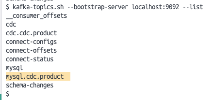

# 카프카 씽크, 소스 커넥터 활용

## 프로젝트 실행
###  debezium-connector-mysql 다운로드 ([링크](https://www.confluent.io/hub/debezium/debezium-connector-mysql))
### start.sh 파일 실행
```bash
sh start.sh
```

### 카프카 커넥터 실행
```bash
curl -X POST http://localhost:8083/connectors \
  --data '{
  "name": "debezium-mysql-connector",
  "config": {
        "connector.class": "io.debezium.connector.mysql.MySqlConnector",
        "tasks.max": "1",
        "database.hostname": "database",
        "database.port": "3306",
        "database.user": "root",
        "database.password": "",
        "database.server.id": "111222333",
        "database.server.name": "product-history",
        "topic.prefix": "mysql",
        "table.include.list": "cdc.product",
        "topics": "product-history",
        "database.allowPublicKeyRetrieval": "true",
        "schema.history.internal.kafka.bootstrap.servers": "kafka:9092",
        "schema.history.internal.kafka.topic": "schema-changes"
  }
}' -H "Content-Type: application/json"
```
### 카프카 커넥터 연결 상태 확인
```bash
curl -X GET http://localhost:8083/connectors/debezium-mysql-connector/status
```

### db 테이블 insert 
```bash
insert into product (name, price) values ("carrot", 10000);
```

### 카프카 토픽 생성 확인
```bash
kafka-topics.sh --bootstrap-server localhost:9092 --list
```


### 카프카 토픽 데이터 확인
```bash
kafka-console-consumer.sh --bootstrap-server localhost:9092 --topic mysql.cdc.product --from-beginning
```
```
# 1
{"schema":{"type":"struct","fields":[{"type":"struct","fields":[{"type":"int32","optional":false,"field":"id"},{"type":"string","optional":true,"field":"name"},{"type":"bytes","optional":true,"name":"org.apache.kafka.connect.data.Decimal","version":1,"parameters":{"scale":"0","connect.decimal.precision":"10"},"field":"price"}],"optional":true,"name":"mysql.cdc.product.Value","field":"before"},{"type":"struct","fields":[{"type":"int32","optional":false,"field":"id"},{"type":"string","optional":true,"field":"name"},{"type":"bytes","optional":true,"name":"org.apache.kafka.connect.data.Decimal","version":1,"parameters":{"scale":"0","connect.decimal.precision":"10"},"field":"price"}],"optional":true,"name":"mysql.cdc.product.Value","field":"after"},{"type":"struct","fields":[{"type":"string","optional":false,"field":"version"},{"type":"string","optional":false,"field":"connector"},{"type":"string","optional":false,"field":"name"},{"type":"int64","optional":false,"field":"ts_ms"},{"type":"string","optional":true,"name":"io.debezium.data.Enum","version":1,"parameters":{"allowed":"true,last,false,incremental"},"default":"false","field":"snapshot"},{"type":"string","optional":false,"field":"db"},{"type":"string","optional":true,"field":"sequence"},{"type":"string","optional":true,"field":"table"},{"type":"int64","optional":false,"field":"server_id"},{"type":"string","optional":true,"field":"gtid"},{"type":"string","optional":false,"field":"file"},{"type":"int64","optional":false,"field":"pos"},{"type":"int32","optional":false,"field":"row"},{"type":"int64","optional":true,"field":"thread"},{"type":"string","optional":true,"field":"query"}],"optional":false,"name":"io.debezium.connector.mysql.Source","field":"source"},{"type":"string","optional":false,"field":"op"},{"type":"int64","optional":true,"field":"ts_ms"},{"type":"struct","fields":[{"type":"string","optional":false,"field":"id"},{"type":"int64","optional":false,"field":"total_order"},{"type":"int64","optional":false,"field":"data_collection_order"}],"optional":true,"name":"event.block","version":1,"field":"transaction"}],"optional":false,"name":"mysql.cdc.product.Envelope","version":1},"payload":{"before":null,"after":{"id":1,"name":"carrot","price":"JxA="},"source":{"version":"2.4.2.Final","connector":"mysql","name":"mysql","ts_ms":1713518076000,"snapshot":"first","db":"cdc","sequence":null,"table":"product","server_id":0,"gtid":null,"file":"binlog.000002","pos":757,"row":0,"thread":null,"query":null},"op":"r","ts_ms":1713518076751,"transaction":null}}
# 2
{"schema":{"type":"struct","fields":[{"type":"struct","fields":[{"type":"int32","optional":false,"field":"id"},{"type":"string","optional":true,"field":"name"},{"type":"bytes","optional":true,"name":"org.apache.kafka.connect.data.Decimal","version":1,"parameters":{"scale":"0","connect.decimal.precision":"10"},"field":"price"}],"optional":true,"name":"mysql.cdc.product.Value","field":"before"},{"type":"struct","fields":[{"type":"int32","optional":false,"field":"id"},{"type":"string","optional":true,"field":"name"},{"type":"bytes","optional":true,"name":"org.apache.kafka.connect.data.Decimal","version":1,"parameters":{"scale":"0","connect.decimal.precision":"10"},"field":"price"}],"optional":true,"name":"mysql.cdc.product.Value","field":"after"},{"type":"struct","fields":[{"type":"string","optional":false,"field":"version"},{"type":"string","optional":false,"field":"connector"},{"type":"string","optional":false,"field":"name"},{"type":"int64","optional":false,"field":"ts_ms"},{"type":"string","optional":true,"name":"io.debezium.data.Enum","version":1,"parameters":{"allowed":"true,last,false,incremental"},"default":"false","field":"snapshot"},{"type":"string","optional":false,"field":"db"},{"type":"string","optional":true,"field":"sequence"},{"type":"string","optional":true,"field":"table"},{"type":"int64","optional":false,"field":"server_id"},{"type":"string","optional":true,"field":"gtid"},{"type":"string","optional":false,"field":"file"},{"type":"int64","optional":false,"field":"pos"},{"type":"int32","optional":false,"field":"row"},{"type":"int64","optional":true,"field":"thread"},{"type":"string","optional":true,"field":"query"}],"optional":false,"name":"io.debezium.connector.mysql.Source","field":"source"},{"type":"string","optional":false,"field":"op"},{"type":"int64","optional":true,"field":"ts_ms"},{"type":"struct","fields":[{"type":"string","optional":false,"field":"id"},{"type":"int64","optional":false,"field":"total_order"},{"type":"int64","optional":false,"field":"data_collection_order"}],"optional":true,"name":"event.block","version":1,"field":"transaction"}],"optional":false,"name":"mysql.cdc.product.Envelope","version":1},"payload":{"before":null,"after":{"id":2,"name":"carrot","price":"JxA="},"source":{"version":"2.4.2.Final","connector":"mysql","name":"mysql","ts_ms":1713518076000,"snapshot":"last","db":"cdc","sequence":null,"table":"product","server_id":0,"gtid":null,"file":"binlog.000002","pos":757,"row":0,"thread":null,"query":null},"op":"r","ts_ms":1713518076751,"transaction":null}}
# 3
{"schema":{"type":"struct","fields":[{"type":"struct","fields":[{"type":"int32","optional":false,"field":"id"},{"type":"string","optional":true,"field":"name"},{"type":"bytes","optional":true,"name":"org.apache.kafka.connect.data.Decimal","version":1,"parameters":{"scale":"0","connect.decimal.precision":"10"},"field":"price"}],"optional":true,"name":"mysql.cdc.product.Value","field":"before"},{"type":"struct","fields":[{"type":"int32","optional":false,"field":"id"},{"type":"string","optional":true,"field":"name"},{"type":"bytes","optional":true,"name":"org.apache.kafka.connect.data.Decimal","version":1,"parameters":{"scale":"0","connect.decimal.precision":"10"},"field":"price"}],"optional":true,"name":"mysql.cdc.product.Value","field":"after"},{"type":"struct","fields":[{"type":"string","optional":false,"field":"version"},{"type":"string","optional":false,"field":"connector"},{"type":"string","optional":false,"field":"name"},{"type":"int64","optional":false,"field":"ts_ms"},{"type":"string","optional":true,"name":"io.debezium.data.Enum","version":1,"parameters":{"allowed":"true,last,false,incremental"},"default":"false","field":"snapshot"},{"type":"string","optional":false,"field":"db"},{"type":"string","optional":true,"field":"sequence"},{"type":"string","optional":true,"field":"table"},{"type":"int64","optional":false,"field":"server_id"},{"type":"string","optional":true,"field":"gtid"},{"type":"string","optional":false,"field":"file"},{"type":"int64","optional":false,"field":"pos"},{"type":"int32","optional":false,"field":"row"},{"type":"int64","optional":true,"field":"thread"},{"type":"string","optional":true,"field":"query"}],"optional":false,"name":"io.debezium.connector.mysql.Source","field":"source"},{"type":"string","optional":false,"field":"op"},{"type":"int64","optional":true,"field":"ts_ms"},{"type":"struct","fields":[{"type":"string","optional":false,"field":"id"},{"type":"int64","optional":false,"field":"total_order"},{"type":"int64","optional":false,"field":"data_collection_order"}],"optional":true,"name":"event.block","version":1,"field":"transaction"}],"optional":false,"name":"mysql.cdc.product.Envelope","version":1},"payload":{"before":null,"after":{"id":3,"name":"carrot","price":"JxA="},"source":{"version":"2.4.2.Final","connector":"mysql","name":"mysql","ts_ms":1713518096000,"snapshot":"false","db":"cdc","sequence":null,"table":"product","server_id":1,"gtid":null,"file":"binlog.000002","pos":973,"row":0,"thread":8,"query":null},"op":"c","ts_ms":1713518096043,"transaction":null}}
```
